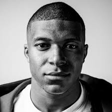

# Colorful World

Deep Learning Project, Fall 2018

Mathilde Duverger 
Sacha Izadi 
Margaux Girard-Soppet
Valentin Lapparov
Alexandre Momeni

Website: https://color-gan-x.herokuapp.com/home

# Project Overview

Our objective is to translate gray-scale photographs into their colorized version. This problem is particularly appealing to us, because it involves a generative, creative work which is easily visualizable. More details on our implementation can be found on our website. 

# Example

